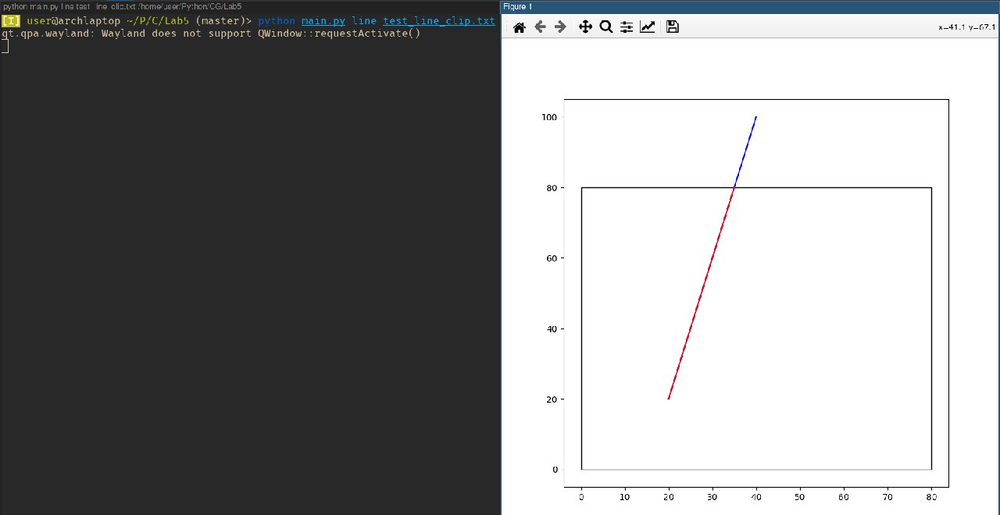
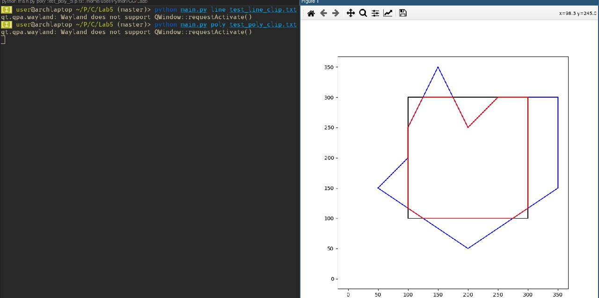

# Лабораторная работа №5. Алгоритмы отсечения отрезков и многоугольников
## Вариант 13
Алгоритм Сазеренда-Коэна для отсечения отрезков четырехугольником.
Алгоритм отсечения выпуклого многоугольника
## Пример использования
### Отсечение отрезков четырехугольником
```
python main.py line test_line_clip.txt
```
Файл test_line_clip.txt (cначала задается список прямых по двум точкам, затем ограничивающий четырехугольник):
```
1
20
20
40
100
0
0
80
80
```
Результат работы:
(Черным цветом обозначен ограничивающий четырехугольник, синим - отрезки, находящиеся вне видимой области, красным - внутри видимой области)

### отсечение выпуклого многоугольника
```
python main.py poly test_poly_clip.txt
```
Многоугольник задается количеством вершин и координатами самих вершин.
Сначала вводится многоугольник для отсечения, ограничивающий многоугольник
Файл test_poly_clip.txt:
```
9
50
150
200
50
350
150
350
300
250
300
200
250
150
350
100
250
100
200
4
100
100
300
100
300
300
100
300
```
(Черным цветом обозначен ограничивающий многоугольник, синим - отрезки, находящиеся вне видимой области, красным - внутри видимой области)

